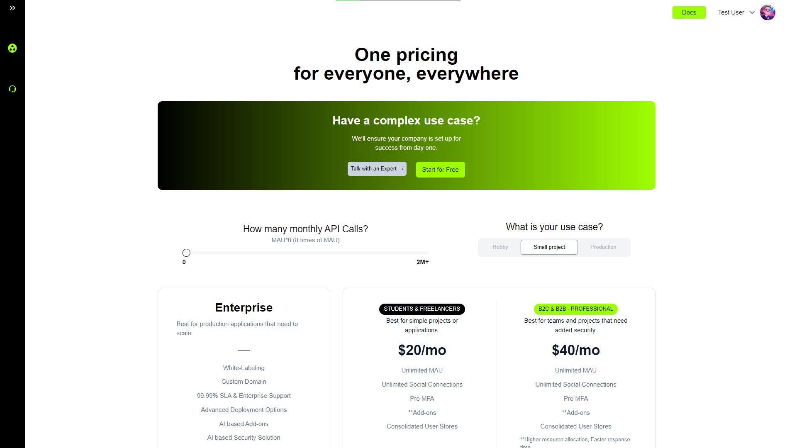
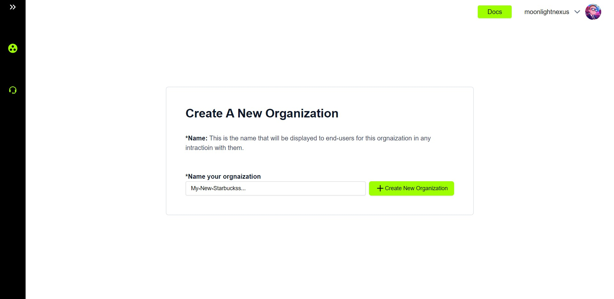
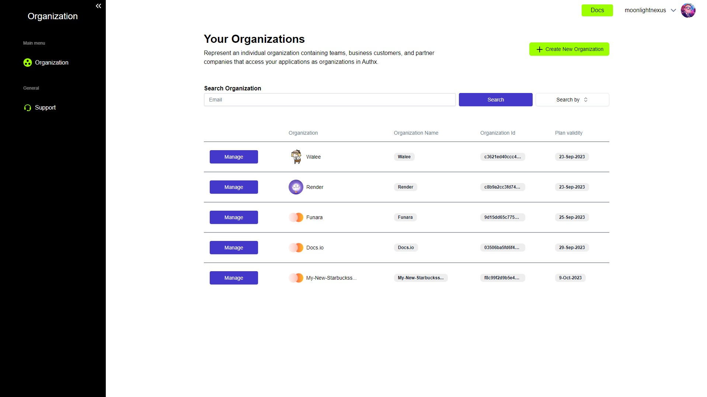
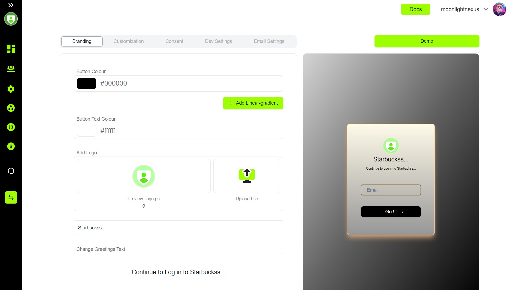

import { Steps } from 'nextra/components'
#import Image from 'next/image'

<Steps>

### Step 1: Sign Up 📝

To get started, you need to sign up at TrustAuthx.

### Step 2: Choose a Plan 📊

Next, you need to choose a plan that suits your needs and click on “Start Free Trial”. You can see the different plans and their features in the image below:

### Step 3: Select Your Use Case 🎯

Then, you need to select your use case as either “Freelancer” or “Business”. This will help us tailor our service to your specific needs. Note: All freelancers will enjoy a 50% discount on the base plan.

### Step 4: Checkout and Create New Organization 🏢

After that, you need to complete the checkout process and create a new organization by entering a relevant identification name. This is where you will manage all your resources.

### Step 5: Save Your Keys 🔑

Now, you need to save all the keys shown in the next step securely. These keys will only be shown once and they are essential for accessing your resources. Check the guide here to read more. After saving the keys, click the checkbox in the button “I’ve stored the keys in a safe place” and proceed ahead to the organization table.

### Step 6: Manage Your Organization ⚙️

From the organization table, you can click on the “Manage” button to see details about specific organizations and find settings.

### Step 7: Check Widget Demo 🖥️

To check the demo of the widget, navigate to widget settings in the side panel and click on it. Then click on the demo button on the top right corner. You can see how the widget works and how it can enhance your website.

</Steps>

That’s it! You have successfully set up your account and you can now proceed with customizing your widget and exploring our application. See how TrustAuthx can benefit your business! 🚀
